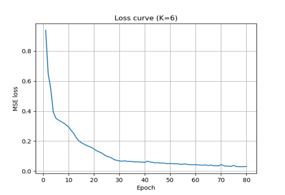
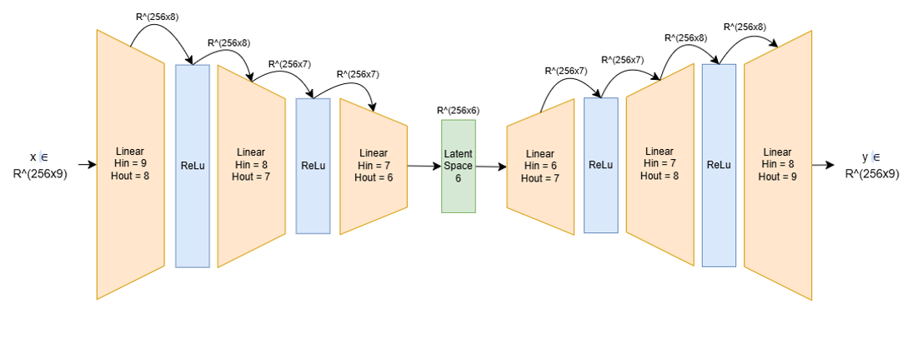
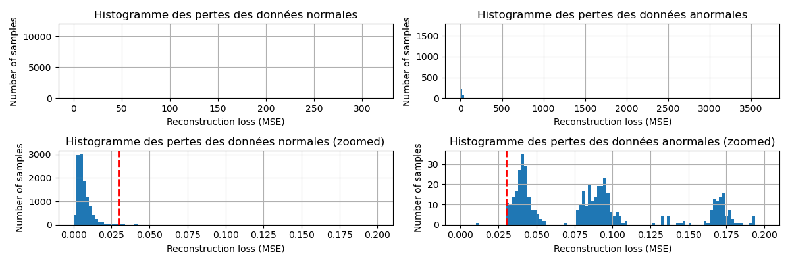
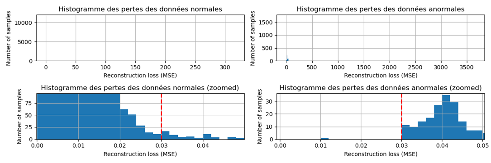
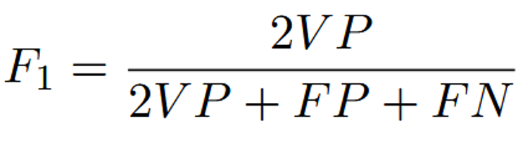
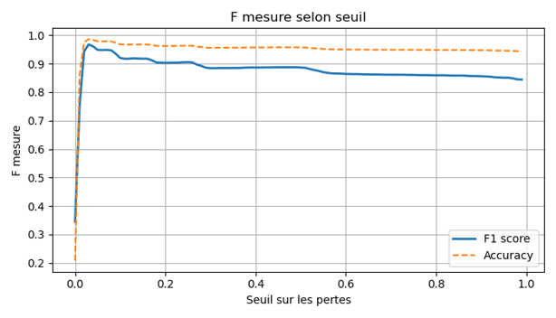

# Détection d'Anomalies par Auto-encodeur (Réseau Encodeur-Décodeur)

Ce projet implémente un réseau de neurones de type auto-encodeur dédié à la détection d'anomalies sur le dataset *Shuttle*. Le modèle apprend à reconstruire exclusivement les données normales afin d'identifier les déviations lors de la phase de test.

## 1. Choix des Hyperparamètres

La sélection des paramètres repose sur une analyse statistique des données pour garantir une compression optimale 

* **Espace Latent (k = 6) :** Basé sur l'analyse des valeurs propres suivantes : $7.9204 \times 10^{-4}, 1.2390 \times 10^{-4}, 2.3841 \times 10^{-3}, 6.2564 \times 10^{-1}, 9.8503 \times 10^{-1}, 1.0004, 1.0245, 1.7436, 3.6172$ 
* **Justification :** On observe 6 valeurs propres significatives, justifiant le choix de k=6 pour l'espace latent.
* **Taux d’apprentissage :** Fixé à **0,0015** pour assurer une stabilisation fluide de la perte 
* **Optimiseur :** **Adam**, utilisé pour sa convergence efficace
* **Epochs :** L'entraînement est réalisé sur **80 époques**. La courbe des pertes montre que le plateau de convergence est atteint vers la 76ème époque 

*Figure 1 : Évolution de la perte MSE (K=6) montrant la stabilisation du modèle.*

## 2. Architecture du Réseau

Le réseau adopte une structure symétrique en "sablier" pour extraire les caractéristiques essentielles des signaux 

*Figure 2 : Schéma de l'architecture du réseau Encodeur-Décodeur.*

* **Dimensions des entrées/sorties :** Entrées de $1 \times 9$ et sorties de $1 \times 9$ 
* **Encodeur :** Trois couches linéaires progressives (9 → 8 → 7 → 6) 
* **Activations :** Utilisation de couches **ReLU** après chaque couche linéaire pour introduire de la non-linéarité
* **Espace Latent :** Dimension compressée de **6** 
* **Décodeur :** Structure miroir de l'encodeur (6 → 7 → 8 → 9) 
* **Sortie finale :** Aucune fonction d'activation n'est appliquée après la dernière couche linéaire pour permettre une reconstruction fidèle des valeurs réelles 

## 3. Stratégie d’Entraînement

L'entraînement est optimisé pour traiter les données normales tout en ignorant les anomalies 

* **Entraînement par lots (Batch Size) :** Utilisation de lots de **256**. Ce choix empirique maximise la vitesse de calcul tout en évitant une généralisation excessive 
* **Prétraitement :** Élimination des données invalides et séparation des étiquettes pour ne garder que les 9 dimensions des capteurs
* **Normalisation :**
    * Calculée uniquement sur les données d'entraînement valides (classe 1)
    * Les données de test sont normalisées avec les moyennes et déviations standard du set d'entraînement pour éviter que les anomalies ne biaisent l'échelle 

## 4. Détermination du Seuil Optimal

La classification finale repose sur le calcul de l'erreur de reconstruction (MSE). Un seuil est déterminé pour séparer le "sain" de l'"anormal" 

* **Méthode :** Recherche du compromis idéal minimisant les Faux Négatifs (FN) et les Faux Positifs (FP)
* **Analyse visuelle :** Utilisation d'histogrammes de pertes pour identifier la séparation entre les deux distributions 

Zoomed in:

*Figure 4 : Distribution des erreurs de reconstruction pour les données normales et anormales.*

* **Évaluation :** Le seuil est validé par la courbe de la F-measure (F1-score) en fonction du seuil appliqué 

*Figure 5 : Évolution de la F-measure et de l'Accuracy selon le seuil sélectionné.*

## 5. Résultats Obtenus

Les performances finales démontrent la haute précision du modèle pour ce jeu de données:
* **F-score :** 0,9912
* **Accuracy :** 98,62 %
* **Test Loss finale :** 2,5372