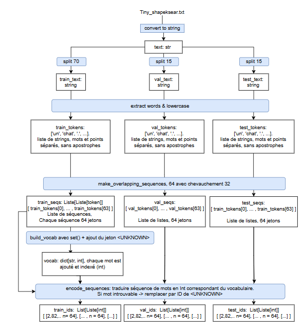
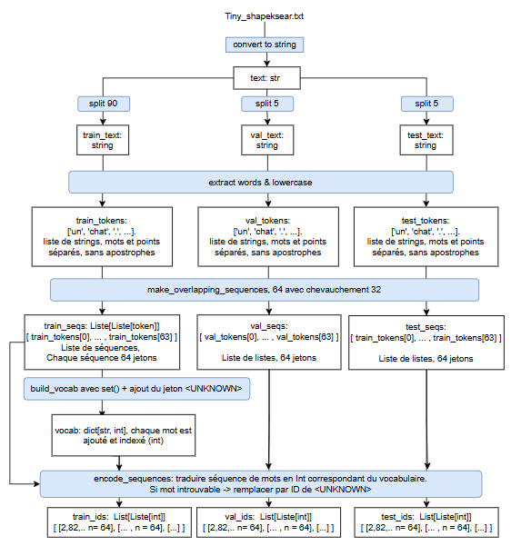
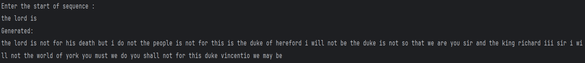
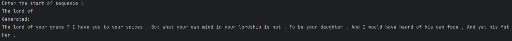
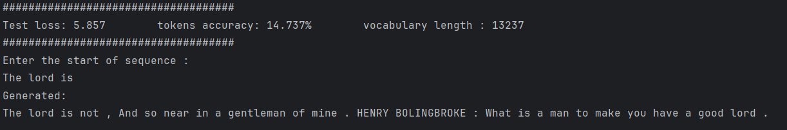
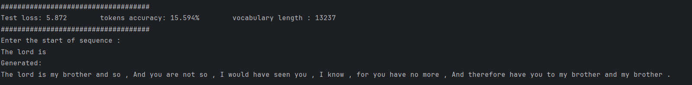
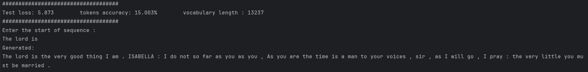

# Projet Transformer : Génération de Texte (Devoir 2)
**Cours :** GEI898 - Apprentissage profond avancé  
**Date :** 12 février 2026  
**Auteurs :** Behrouz Nik-Nejad-Kazem-Pour, Andrei Corduneanu, Kevin Darren Nguemdjom Tchangang

---

## 📝 Description du Projet
Ce projet implémente une architecture de type **Transformer (Décodeur uniquement)** à partir de zéro. L'objectif est d'entraîner un modèle de langage capable de générer du texte dans le style de Shakespeare, en utilisant le jeu de données `tiny_shakespeare.txt`.

## 1. Conversion du texte en jetons (Tokenization)
Avant l'entraînement, les données brutes subissent un prétraitement rigoureux pour être converties en format numérique.

* **Répartition des données (Split 90/5/5) :** Contrairement à la répartition standard (70/15/15), nous avons opté pour **90% d'entraînement, 5% de validation et 5% de test**.  
  *Justification :* Le jeu de données `tiny_shakespeare` étant relativement petit, nous avons maximisé le volume de données d'entraînement pour permettre au modèle de mieux capter les subtilités du langage et d'améliorer sa capacité de généralisation.

* **Nettoyage et Vocabulaire :** Conversion en minuscules, isolation de la ponctuation et création d'un index basé sur l'ensemble d'entraînement.
* **Séquençage et Chevauchement :** Découpage du texte en séquences de longueur fixe ($N=64$) avec une superposition (overlap) pour augmenter le nombre d'exemples.

## 2. Génération de Plongements (Embeddings)
Le modèle convertit les indices entiers en vecteurs riches en informations sémantiques.

* **Token Embedding :** Chaque mot du vocabulaire est projeté dans un espace vectoriel de dimension $D=512$.
* **Position Embedding :** Puisque le Transformer n'a pas de récurrence, nous ajoutons un vecteur positionnel apprenable pour indiquer l'ordre des mots.
* **Résultat :** L'entrée du modèle est la somme : `Vecteur(Mot) + Vecteur(Position)`.

## 3. Architecture Utilisée
Nous avons conçu un Transformer basé sur l'architecture originale "Attention Is All You Need", adapté pour la génération (GPT-style / Decoder-only).

**Structure d'un bloc Transformer :**
1.  **Multi-Head Attention (Masqué)**
2.  **Add & Norm** (Connexions résiduelles + LayerNorm)
3.  **Feed Forward Network** (ReLU)
4.  **Sortie Linéaire** (Projection vers la taille du vocabulaire)

## 4. Mécanisme d’Attention
Le cœur du modèle repose sur l'Auto-Attention (Self-Attention) causale à 8 têtes.

* **8 Têtes d'Attention :** La dimension 512 est divisée en 8 sous-espaces de 64. Cela permet au modèle de se concentrer sur plusieurs aspects linguistiques simultanément (grammaire, rimes, sujet, etc.).
* **Matrices Q, K, V :** Chaque mot génère une Requête (Query), une Clé (Key) et une Valeur (Value).
* **Masque Causal :** Une matrice triangulaire supérieure (remplie de $-\infty$) est appliquée pour empêcher le modèle de "voir le futur" lors de l'entraînement.
## 5. Résultats et Évolution du Modèle

Nous avons testé plusieurs configurations pour observer l'impact du prétraitement et des hyperparamètres sur la qualité du texte généré. Voici l'évolution de nos résultats :

### 1. Génération sans contrainte (`Gen_sansLimite`)

* **Configuration :** Aucune limite de longueur de phrase, pas de séquence maximum définie, et la ponctuation n'était pas considérée comme des jetons significatifs dans les plongements.
* **Résultat :** Le modèle génère des phrases sans fin ("run-on sentences"). Il n'apprend pas à conclure une idée car il ne possède pas de mécanisme d'arrêt structurel.

### 2. Introduction de la structure (`Gen_LimitePhrase`)

* **Configuration :** Intégration de la ponctuation dans le vocabulaire. Nous avons imposé un minimum de génération et défini une condition d'arrêt : la génération stoppe lorsque le modèle prédit un point final (`.`).
* **Résultat :** Les phrases ont maintenant une structure délimitée, ressemblant davantage à des répliques de théâtre.

### 3. Architecture Standard (`Gen_4Head_512`)

* **Configuration :** Attention à **4 têtes** et dimension de plongement (embedding) de **512**.
* **Résultat :** Un modèle équilibré qui produit du texte cohérent syntaxiquement avec une complexité de calcul raisonnable.

### 4. Augmentation de la capacité (`Gen_32Head_800`)

* **Configuration :** Attention à **32 têtes** et dimension de plongement de **800**.
* **Analyse :**
    * **Dimension 800 :** En augmentant la taille du vecteur (de 512 à 800), chaque mot est décrit avec plus de précision. Le modèle peut retenir davantage de "particularités" et de nuances sémantiques pour chaque jeton.
    * **32 Têtes :** En multipliant le nombre de têtes, le modèle peut capturer et comprendre un plus grand nombre de relations complexes entre les mots simultanément (accords lointains, contexte thématique, etc.).

### 5. Modèle Profond (`Gen_32Head_800_5Trans`)

* **Configuration :** Mêmes hyperparamètres que précédemment (32 têtes, dim 800), mais avec **5 couches** de blocs Transformer empilées.
* **Résultat :** C'est notre modèle le plus puissant. La profondeur accrue permet au réseau de développer des niveaux d'abstraction supérieurs, améliorant la cohérence globale du texte généré.